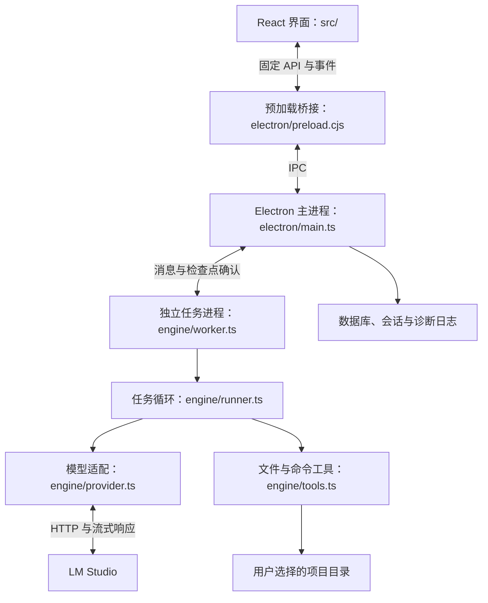

# Jalo 项目结构说明

这份文档介绍 Jalo 的目录划分、模块职责和任务执行流程，供阅读源码与后续维护使用。启动和使用步骤见 [README](../README.md)，安装包操作见 [打包说明](packaging.md)。

## 1. 项目整体架构

Jalo 是佳乐（Jiale）发起的 macOS 本地编程助手。Electron 提供桌面窗口和系统能力，React 提供界面，独立任务进程调用 LM Studio 并操作用户选择的项目。模型推理由 LM Studio 提供。



四个主要目录的分工是：

| 目录 | 负责什么 | 关键边界 |
| --- | --- | --- |
| `src/` | 页面、交互、任务展示与界面状态 | 通过 `window.localCode` 调用固定接口，不能直接使用 Node 文件系统 |
| `electron/` | 窗口、IPC、任务队列、用户确认、数据保存 | 主进程掌握任务调度和数据库写入 |
| `engine/` | 模型请求、执行循环、上下文与工具 | 普通模型回复不作为可执行代码；直接文件工具限制在所选项目内 |
| `shared/` | 类型、校验规则、状态转换和传输数据结构 | 供界面、主进程与引擎共同使用；其中部分模块依赖 Node，仅用于相应运行环境 |

主进程也使用 `engine/` 中的模型管理、文件预览、引用与回退函数，因此这些目录表示职责划分，不是完全隔离的依赖层。

## 2. 顶层目录

```text
jalo/
├── src/                    React 界面和交互
├── electron/               Electron 主进程、预加载桥接和持久化
├── engine/                 模型适配与任务执行引擎
├── shared/                 共享类型、校验与数据处理
├── tests/                  逻辑测试与回归测试
├── scripts/                开发启动、构建与验收脚本
├── docs/                   架构、打包和可靠性验收文档
├── index.html              界面 HTML 入口与内容安全策略
├── package.json            依赖、版本与 npm 命令
├── package-lock.json       npm 依赖锁定文件
├── tsconfig.json           TypeScript 配置
├── electron-builder.json   macOS 安装包配置
├── 启动.command            macOS 双击启动入口
├── AGENTS.md               项目开发约定
├── README.md               项目介绍、使用说明与限制
├── VALIDATION.md            验收记录
└── LICENSE                 MIT 许可证
```

`node_modules/` 是安装后的依赖目录；`dist/` 和 `release/` 分别是构建和打包产物，不是源码。它们已被 Git 忽略。用户的任务数据库与文件备份存放在应用数据目录，也不属于仓库源码。

## 3. 各模块负责什么

### `src/`：界面层

| 文件 | 职责 |
| --- | --- |
| `main.tsx` | React 入口和整体页面；组织项目选择、任务提交、设置与三栏界面 |
| `style.css` | 页面布局、配色和组件样式 |
| `task-history.tsx`、`task-list-window.ts` | 任务列表按视口挂载、键盘导航、搜索、重命名、归档及项目移除确认 |
| `task-detail.ts` | 按需加载当前任务详情，处理切换任务时的过期响应 |
| `event-history.ts`、`history-controls.tsx` | 按事件 ID 直达分页、前后翻页、最多缓存 600 条事件与保存的计划入口 |
| `timeline-rows.tsx`、`timeline-window.ts`、`tool-card.tsx`、`tool-events.ts` | 按实测高度挂载可见聊天行、保存阅读锚点与工具卡展开状态、调用/结果分组 |
| `streaming-reply.tsx` | 流式文字累积与展示，处理重复或过期片段 |
| `task-progress.tsx`、`context-usage.tsx` | 当前执行阶段、失败恢复提示和上下文用量 |
| `mention-input.tsx`、`mentions.ts` | 输入框中的 `@` 文件候选与引用交互 |
| `file-tree.tsx` | 项目目录树和文件名搜索 |
| `reliability.tsx` | 文件引用预览、轮次结果、文件差异与回退交互 |
| `session-scroll.ts` | 保存和恢复聊天阅读位置 |
| `remote-resource.ts` | 按资源标识加载远端数据，避免旧请求覆盖新选择 |
| `model-evaluation.tsx`、`app-maintenance.tsx` | 模型能力实测、应用信息与诊断操作 |

### `electron/`：桌面与调度层

| 文件 | 职责 |
| --- | --- |
| `bootstrap.cjs` | 开发模式入口，通过 `tsx` 加载 `main.ts` |
| `main.ts` | 创建窗口、注册并校验 IPC、管理摘要目录与执行中的完整任务、FIFO 队列、任务进程、审批和回退 |
| `preload.cjs` | 通过 `contextBridge` 暴露固定的 `window.localCode` 方法和订阅接口 |
| `worker.cjs` | 开发模式任务进程入口，通过 `tsx` 加载 `engine/worker.ts` |
| `store.ts` | 内置 SQLite/WAL、版本迁移与备份、摘要/详情索引、事件分页、按需读取轮次与检查点、合并事务与持久化 |
| `session.ts` | 保存草稿、引用、所选任务和阅读位置等界面会话状态 |
| `ipc-updates.ts` | 合并任务摘要更新与流式回复片段，减少 IPC 传输 |
| `evaluation.ts` | 实测进程生命周期、与普通任务互斥及报告持久化 |
| `diagnostics.ts` | 结构化诊断日志、轮转、错误分类和诊断导出 |

界面进程启用 sandbox 与 contextIsolation，并禁用 Node 集成。增加桌面能力时，需要同时维护共享 API 类型、预加载桥接和主进程处理器；不能仅在界面中添加调用。

### `engine/`：执行层

| 文件 | 职责 |
| --- | --- |
| `worker.ts` | 接收主进程消息，准备模型与引用，创建执行器，转发事件并等待审批/检查点确认 |
| `provider.ts` | 定义 `ModelProvider`，实现 LM Studio 模型列表、加载/卸载和流式推理 |
| `runner.ts` | 工具调用探测、模型与工具循环、步骤上限、重试、模式指令和结束状态 |
| `tools.ts` | 工具定义、参数校验、路径保护、读取/编辑、备份、命令确认与执行证据 |
| `project-files.ts` | 界面用的目录浏览、预览、引用快照、回退预览与文件恢复 |
| `file-search.ts` | 安全遍历、扫描预算和文件名索引缓存 |
| `context.ts` | 上下文预算估算与历史压缩，保留用户要求和完整工具调用组 |
| `completion.ts` | 根据真实工具证据检查回复中的无依据执行声明；不把回复文本转成工具调用 |
| `syntax.ts` | JS、TS、JSON 与 Vue 的本地语法解析，以及内容版本哈希 |
| `vue-elements.ts` | 按标签、属性和文本定位 Vue 模板元素，为精确修改提供范围 |
| `evaluation.ts` | 在临时项目中执行模型能力样例，按实际文件与工具记录验收 |

`provider.ts` 使用 LM Studio 原生 `/api/v1/models` 系列接口管理模型，使用兼容 OpenAI 的 `/v1/chat/completions` 接口推理。网络请求集中在适配器中。

### `shared/`：协议与规则

| 文件 | 职责 |
| --- | --- |
| `types.ts` | 项目、设置、任务、轮次、引用、工具事件、审批与 API 类型 |
| `validation.ts` | 使用 Zod 校验设置、提交输入和文件引用 |
| `session.ts` | 会话状态结构、校验、保存与恢复规则 |
| `task-wire.ts` | 将内部任务转换成界面摘要/详情，生成差异元数据并查询任务 |
| `app-state.ts` | 把增量 IPC 更新合并到界面快照 |
| `task-history.ts` | 事件分页、历史快照、计划正文恢复与关联计划上下文 |
| `context.ts` | 上下文记忆与用量类型、发送给模型的消息整理 |
| `progress.ts` | 阶段名称、修改状态与恢复提示规则 |
| `evaluation.ts` | 实测报告结构与状态处理 |

## 4. 一次任务如何执行

1. 用户在界面选择项目、模式和文件引用，提交要求。`src/main.tsx` 通过预加载 API 发出 IPC 请求。
2. 主进程校验输入、核对引用版本，创建或更新任务，并保存本次轮次，然后放入队列。同一时间只执行一个普通任务。
3. 主进程启动 Electron `utilityProcess`。`engine/worker.ts` 检查模型、准备实例和上下文容量，再创建工具注册表与 `TaskRunner`。
4. 执行器读取适用的 `AGENTS.md`，检测模型是否能返回真正的结构化工具调用，然后进入“模型请求 → 工具执行 → 结果反馈”循环。
5. 文件修改需通过版本检查、支持语言的语法解析、备份与持久化检查点；命令需等待用户逐条允许。计划和审查模式在工具列表和执行入口限制写入与命令。
6. 引擎把进度、聊天、工具结果、差异和结束状态传回主进程。主进程保存记录，再通过摘要更新和文字片段通知界面；详情、历史页、计划和差异正文按需加载。
7. 本轮结束后，主进程处理下一项排队任务。界面以实际写入记录展示结果；模型的完成声明不代替验收。

这里需要区分几个对象：`Project` 是用户选择的目录，`Task` 是可持续补充要求的任务，`Run` 是一次提交产生的轮次，`Event` 是用户可见的过程记录，`Message` 是模型上下文。文件检查点 `RunChange` 保存该轮修改前后的内容、版本与写入状态。

## 5. 文件修改和数据保存

文件写入由 `engine/tools.ts` 执行，关键顺序为：读取并核对原文 → 生成候选内容 → 语法检查 → 保存检查点并等待主进程确认 → 保存原文备份 → 写入并重读核对。遇到外部修改、路径越界或不允许的链接时拒绝操作。

回退由主进程协调 `engine/project-files.ts` 完成：先预览，再核对当前文件仍等于该轮写入后的内容，保留恢复副本后再恢复。项目有未结束任务时不开放回退。

应用数据位于 Electron 的实际 `userData` 目录。新安装通常使用 `~/Library/Application Support/Jalo/`；已有旧版数据库时继续使用 `~/Library/Application Support/Local Code/`。

```text
<userData>/
├── local-code.sqlite       项目、任务、设置、轮次、事件、检查点和实测报告
├── local-code.sqlite-wal   尚未合并回主库的已提交页（运行时可能存在）
├── local-code.sqlite-shm   WAL 共享索引（运行时可能存在）
├── ui-session.json         草稿、引用、选择和阅读位置
├── backups/<task-id>/      文件首次修改前的原文备份
├── recovery/<run-id>/      回退操作的恢复副本与日志
└── logs/                   结构化诊断日志及轮转文件
```

数据库由主进程作为单写入者管理，目前 schema 版本为 7。`task_catalog` 与任务写入同一事务，保存摘要、去除正文的详情视图、用户要求搜索文本和异常退出恢复标记。启动只解析摘要，并恢复标记为未完成的任务；低于 v6 的旧库逐个任务建立目录，v6 转为原生 SQLite 时无需重新加载全部历史。

浏览已完成任务时，事件根据任务 ID、事件游标及序号直接查询数据库，每页最多 100 条；计划和检查点按轮次读取。完整任务仅在执行、排队、继续或确认回退时载入，操作结束且保存成功后释放。搜索、重命名和归档不加载完整历史。仍待保存或保存失败的对象保留在内存中，防止读取旧版本覆盖更新。

存储使用 [Node 内置 SQLite](https://nodejs.org/download/release/v22.14.0/docs/api/sqlite.html)，不再将整库加载到 WASM 或每次导出替换文件。每次 flush 将待保存任务、项目、设置、报告和元数据放进同一个 `BEGIN IMMEDIATE` 事务；`COMMIT` 成功后才发布历史索引并清空队列。失败时回滚、通知待保存任务并保留数据以便重试。

连接使用 [WAL + synchronous=FULL](https://www.sqlite.org/pragma.html#pragma_synchronous)，关键确认以事务提交为边界；不为每次保存强制执行 checkpoint。自动 checkpoint 阈值为 1000 页，WAL 回收后的保留目标为 16 MiB，SQLite 页缓存目标为 8 MiB；长时间读事务仍可能阻止 WAL 回收。普通过程记录以 200 毫秒窗口合并保存；检查点、命令确认和任务开始/结束等关键记录立即保存。令牌通过 Electron `safeStorage` 加密后入库。

升级备份先于 WAL 模式切换和数据迁移完成，并同步备份文件及目录。没有 WAL 的旧库保留原字节；存在 WAL 时用 `VACUUM INTO` 创建含已提交页的完整备份。复制数据目录前应退出应用，并保留可能存在的 WAL/SHM 文件。

直接文件工具的路径保护不等于终端系统沙箱。确认后的命令以当前用户身份执行，可能影响项目外资源；差异面板只追踪通过文件工具产生的修改。

## 6. 启动、脚本与测试

开发使用 Node.js 22.14+。`npm run dev` 执行 `scripts/dev.mjs`，启动 Vite 开发服务和 Electron；主进程与任务进程通过 `tsx` 加载 TypeScript 源码。

| 入口 | 用途 |
| --- | --- |
| `npm test` | 执行 `tests/*.test.ts` 逻辑测试 |
| `npm run test:live` | 执行 `scripts/live.ts`，用临时项目验收真实模型 |
| `scripts/reliability-live.ts` | 文本读取/修改与 Vue 元素修改专项实测 |
| `scripts/session-smoke.cjs` | 使用临时数据和模拟任务操作 Electron 界面，检查会话恢复 |
| `scripts/build.mjs` | 构建界面与主进程/任务进程，生成 `dist/` |
| `electron-builder.json` | 配置 ARM64 macOS DMG，产物位于 `release/` |

构建时 Vite 输出 `dist/renderer/`，esbuild 输出 `dist/electron/main.cjs` 和 `worker.cjs`，并复制预加载文件。安装版入口使用生成的 `main.cjs`。

按项目约定，日常修改不运行编译或打包；逻辑验证使用 `npm test`。真实模型验收只操作临时样例项目，不修改其他业务仓库。测试按模块分布，覆盖模型协议、执行循环、文件保护、上下文、数据库、引用、回退、IPC、会话与历史记录等行为。

## 7. 常见改动从哪里入手

| 想修改的功能 | 优先查看 |
| --- | --- |
| 页面布局、颜色和基础交互 | `src/main.tsx`、`src/style.css` 及对应组件 |
| 添加一个界面可调用的能力 | `shared/types.ts` → `electron/preload.cjs` → `electron/main.ts` → 界面组件 |
| 模型连接、流式协议或模型管理 | `engine/provider.ts`；任务启动准备同时看 `engine/worker.ts` |
| 任务重试、步骤限制、完成判定 | `engine/runner.ts`、`engine/completion.ts` |
| 增加模型工具或调整文件安全规则 | `engine/tools.ts`，以及相关语法/路径模块和工具测试 |
| 文件引用、搜索与预览 | `src/mention-input.tsx`、`src/file-tree.tsx`、`src/reliability.tsx`、`engine/project-files.ts`、`engine/file-search.ts` |
| 任务队列、审批与停止 | `electron/main.ts`、`engine/worker.ts`、`engine/tools.ts` |
| 历史存储、数据库迁移 | `electron/store.ts`、`shared/task-history.ts`、`shared/task-wire.ts` |
| 草稿与阅读位置恢复 | `electron/session.ts`、`shared/session.ts`、`src/session-scroll.ts` |
| 模型能力实测 | `src/model-evaluation.tsx`、`electron/evaluation.ts`、`engine/evaluation.ts`、`shared/evaluation.ts` |

建议第一次读源码时，先看 `shared/types.ts` 理解对象，再沿 `src/main.tsx` → `electron/preload.cjs` → `electron/main.ts` → `engine/worker.ts` → `engine/runner.ts` → `engine/tools.ts` 阅读一条完整任务链路。

文件搜索遵守根目录及嵌套 `.gitignore`（含否定规则，已排除目录不再遍历），规则文件只读取项目内普通文件，最大 64 KiB。规则文件修改使缓存失效；固定依赖目录和符号链接仍排除。界面搜索支持 `ext:ts`、`in:src` 与多个文件名词组合，优先精确文件名及文件名前缀；模型搜索支持目录和扩展名过滤。直接引用和文件工具仍独立执行路径及版本检查。

任务摘要列表通过 `(createdAt,id)` 游标按项目、归档分类和查询条件分页，每页最多 100 条；相同时间戳仍有稳定次序。启动快照仅含最近 100 条、已保存选择及运行/排队任务，历史摘要按需查询，主进程缓存已完成摘要最多 200 条。分页和状态更新合并时以较新 revision 为准；旧查询响应不混入切换后的列表。标题/要求搜索保持字面量匹配并限制单页返回量，中文不依赖分词。

运行中可编辑文字要求，默认排队到下一轮；也可选择调整当前任务。要求持久提交后交给任务进程，进程在完整工具调用组边界加入上下文；新要求到达后跳过尚未开始的旧调用。已开始的文件写入、审批或命令先结束，继续保留命令逐条确认。界面区分等待下一轮和等待当前任务接收；最多保留 20 条。成功结束后按 FIFO 开始下一条，停止、失败及重启后只保留待处理要求，需手动继续；排队要求可取消，正在交接的要求需先停止任务。运行中仅发送文字，文件引用保留在草稿中。

命令输出单独保存到 `commands/<task-id>/<run-id>/<command-id>.log`，每条最多 16 MiB；命令记录包含起止时间、退出码、超时及截断状态。界面每页最多 64 KiB，保留最近 16000 字符末尾摘要；传给模型的长输出保留开头及末尾。对话流只显示前 32000 字符，避免日志淹没历史。日志写入失败会终止该命令并报告错误；重启将未结束命令标记中断，不自动重放。仍使用非交互命令与逐条确认，交互终端和长期后台进程作为后续能力。备份整个数据目录时包含 commands/。

Git 工作区审查是独立的只读入口：按需读取仓库根目录的状态和所选文件，覆盖命令与外部编辑；列表最多 200 个文件，文本文件最多 256 KB，预览差异最多 48000 字符。对比 HEAD 与工作文件，显示暂存/未暂存状态、重命名及删除；差异行可导航到当前原文，删除行只提供旧行号。子目录不能借父仓库查看项目外改动，文件读取沿用项目路径与符号链接限制，Git 不运行外部 diff/textconv 或 hooks。当前不提供暂存、提交及逐块 Git 写操作。
点击“审查这个文件/所选差异”只填入草稿和捕获版本，用户发送后由主进程重新核对；排队任务启动时再次核对，变化则要求重新选择。完整审查差异保存在轮次记录中，历史轮次可按需查看捕获的原始差异，普通 IPC 视图只带目标元数据；审查模型只收到只读工具，show_changes 返回捕获的 Git 差异。审查草稿目标随会话保存，失败和重启均不会自动执行 Git 写操作。

长任务续接区分步骤上限、上下文不足、输出上限、停止与中断，并在轮次结束/重启恢复时保存有界核对摘要。用户查看摘要后重新确认目标、约束与验收条件，主进程核对轮次和文件版本、估算上下文预算，再创建关联的新轮次。要求过长或历史不完整时不会自动截断目标，需在续接窗口明确整理。完整聊天事件、旧消息与检查点保留；contextStart 只移动模型活动上下文边界，后续消息增量及压缩不能修改归档前缀。进程启动时重新核对续接文件；旧工具调用、读取授权和命令批准不沿用。摘要按需读取，不随任务列表/详情反复发送；未核验写入与模型待办线索不作为完成证据。
